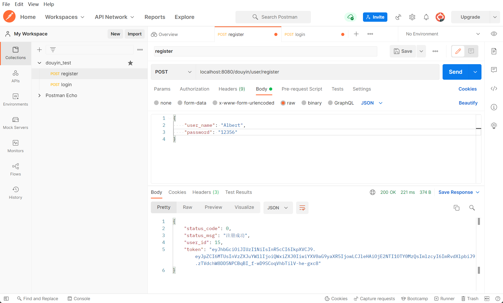

# ADDD_DOUYIN
This is a project for a group. The goal is for the champion.
这是一个团队工程。

**实现的一个mini版抖音服务端**

## 1.基础接口
   1. - [x]  视频流接口  
   2. - [x]  用户注册
   3. - [x]  用户登录      
   4. - [x]  用户信息    
   5. - [x]  投稿接口
   6. - [x]  发布接口

## 2.扩展接口 - I
   1. - [x]  赞操作
   1. - [x]  点赞列表
   2. - [x]  评论操作
   3. - [x]  评论列表
   
## 2.扩展接口 - II
   1. - [x]  关注操作
   1. - [x]  关注列表
   2. - [x]  粉丝列表


## 项目结构

```shell
douyin/
├── conf
├── controller
├── model
├── routes
├── serializer
├── service
└── util
```

- conf : 用于存储配置文件
- controller : 用于处理请求JSON格式返回
- model : gorm使用的数据库模型
- routes : 路由转发
- serializer：定义序列化json的结构体
- service : 具体的功能处理逻辑


## 如何运行本项目

**1.下载第三方库**
```go
go mod tidy
```
**2.配置数据库**
项目已经使用gorm2且开启了**数据库自动迁移模式**，仅需在conf/config.ini文件中配置好参数，建立douyin数据库，启动服务器即可

**3.运行**
```go
go run main.go
```
运行项目生成数据表后，请运行以下SQL语句使得Gorm大小写敏感
```SQL
ALTER TABLE user MODIFY COLUMN name VARCHAR(50) BINARY CHARACTER SET utf8 COLLATE utf8_bin DEFAULT NULL;
```
**4.测试**
1. 可以使用**postman**对接口进行测试

1. 也可使用客户端测试


